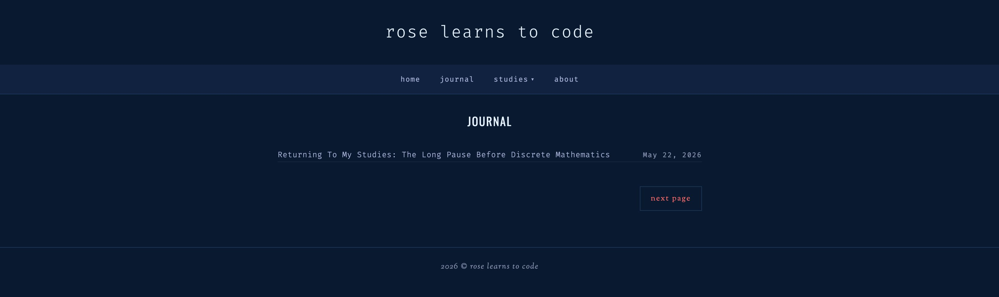
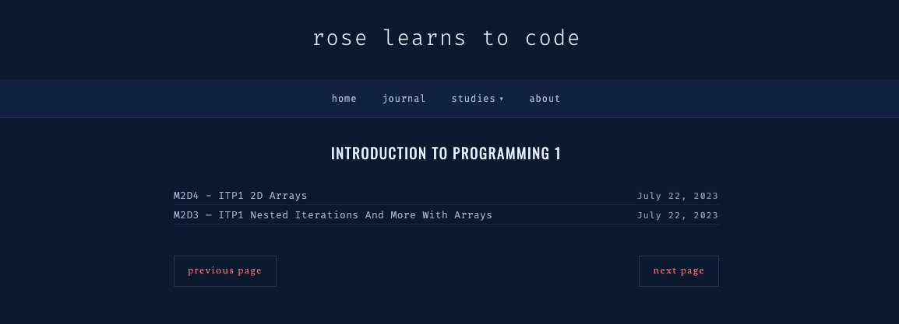

# Rose Learns to Code: Blogger Theme Customization

A dark, terminal-inspired customization layer for the **Delilah** Blogger theme, built for a computer science study journal: rendered math, highlighted code, diagrams, a self-updating Studies menu, and a one-line post index.

**Live:** https://roselearnstocode.com



## Important: the base theme is not included

Delilah is a paid theme by November Dahlia (novemberdahlia.etsy.com). This repository contains **only my customizations**. Buy your own copy of the theme, then apply these files to it. Check your theme license before removing the designer's footer credit.

## What's in the layer

- **Math:** KaTeX 0.16.9, including a renderer for equations migrated from the WordPress KaTeX plugin
- **Code:** Prism.js 1.29.0 with line numbers, copy button, language labels, and an on-demand grammar loader, recolored to the palette
- **Diagrams:** Mermaid 10.6.1 themed to the palette
- **Navigation:** Home, Journal, Studies, About; the Studies dropdown builds itself from your post labels
- **Post index:** every list page (home, pagination, labels, search) shows one line per post, title left and date right, no sidebar
- **Sidebar widgets:** Goodreads bookshelf, currently reading, latest 20 posts, currently studying (3 most recent course labels), cheat sheet links
- **Cheat sheet pages:** LaTeX, code blocks, and Mermaid references for writing posts



## Install

Full instructions with every step and the reasons behind each fix are in [docs/BUILD.md](docs/BUILD.md). In short:

1. Back up your current theme, then install Delilah.
2. Add the fonts from `theme-edits/google-fonts-link.xml` and the colors from `theme-edits/variables.xml`.
3. Paste `head/head-includes.xml` after `<b:include data='blog' name='all-head-content'/>`.
4. Replace the homepage body class with `theme-edits/body-classes.xml`.
5. Paste `css/rose-customizations.css` just before `]]></b:skin>`.
6. Paste `nav/custom-nav-menu.html` just before `<nav class='main-menu-wrapper'>`.
7. Add each file in `widgets/` as an HTML/JavaScript gadget.

## Palette

| | Hex |
|---|---|
| Background | `#0a192f` |
| Panels | `#112240` |
| Borders | `#1d3557` |
| Muted text | `#8892b0` |
| Body text | `#e6f1ff` |
| Accent | `#FF6B6B` |

## Files

```
head/          library includes for <head>
theme-edits/   fonts, Theme Designer variables, body classes
css/           the override layer
nav/           custom navigation
widgets/       sidebar gadgets
cheatsheets/   reference pages
docs/          build documentation and case study
screenshots/   captures of the live blog
```

License: MIT for the files in this repository. The Delilah theme remains under its own license.
